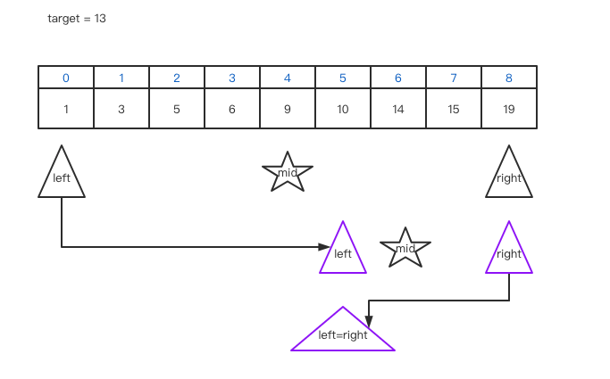

### 二分查找/折半查找

#### 前提

数列有序; 

数列使用顺序存储结构

#### 过程

将目标元素与有序数列的中间元素比较大小, 比中间元素大, 则在数列的右半部分查找, 比中间元素小, 则在数列的左半部分查找, 如果相等, 则找到.

不会查找所有的元素, 查找的数据量正好符合元素的对数, 正常情况每次查找的元素都在对半减少.所以时间复杂度为 $O(log_2N)$.



#### 优化

根据要找的key的大小, 从更接近的位置进行查找.eg.1-100000找10, 肯定采取顺序查找而不是折半查找.

called 插值查找. 适用于数列比较大&均匀的数列.

#### 使用场景

有序; 元素个数较多; 不进行频繁增删

#### 代码实现

##### 普通的二分查找

```javascript
// 标准的二分查找模板
var binary_search = (nums, target) => {
  let len = nums.length;
  if(len == 0) return -1;
  let left = 0, right = len - 1; // 注意! [0, nums.length-1] 闭区间
  let mid = 0;
  // 停止条件: 找不到/数组为空
  // 找不到时是区间为空 当 left=right+1 时区间为空
  // 注意!
  while (left <= right) {
    // 防止使用 (left+right)/2 计算 mid 时溢出 
    mid = left + Math.floor((right - left) / 2);
    if (nums[mid] == target) {
      return mid;
    } else if (nums[mid] > target) { // 对于已经比较过的mid 不应该在下一次进行搜索的区间内
      right = mid - 1; // 注意!
    } else if (nums[mid] < target) {
      left = mid + 1; // 注意!
    }
  }
  return -1;
}
```


##### 寻找左侧边界的二分查找(模板)

```javascript
var search_left = (nums, target) => {
  let len = nums.length;
  if (len == 0) return -1;
  let left = 0, right = len - 1, mid = 0;
  // 循环停止条件是 left = right + 1
  while (left <= right) {
    mid = left + Math.floor((right - left) / 2);
    if (nums[mid] == target) { // 关键 !!! 向左缩小区域
      right = mid - 1; // 探索区间为 [left, mid-1]
    } else if (nums[mid] > target) {
      right = mid - 1; // 探索区间为 [left, mid-1]
    } else if (nums[mid] < target) {
      left = mid + 1; // 探索区间为 [mid+1, right]
    }
    // console.log('left:', left, 'mid:', mid, 'right:', right);
  }
  // 处理数组越界情况
  // target>所有值(left==nums.length) || target<所有值(right==-1)
  // nums[left] != target ps.即使right == -1 left==0 nums[0]也有可能是target
  if (left == len || nums[left] != target) {
    return -1;
  }
  return left;
}
```


##### 寻找右侧边界的二分查找(模板)

```javascript
var search_right = (nums, target) => {
  let len = nums.length;
  if (len == 0) return -1;
  let left = 0, right = len - 1, mid = 0;
  // 循环停止条件是 left = right + 1
  while (left <= right) {
    mid = left + Math.floor((right - left) / 2);
    if (nums[mid] == target) { // 关键!!! 向右缩小区域
      left = mid + 1; // 探索区间为 [mid+1, right]
    } else if (nums[mid] > target) {
      right = mid - 1; // 探索区间为 [left, mid-1]
    } else if (nums[mid] < target) {
      left = mid + 1; // 探索区间为 [mid+1, right]
    }
    // console.log('left:', left, 'mid:', mid, 'right:', right);
  }
  // 处理数组越界情况
  // target>所有值(left==nums.length) || target<所有值(right==-1)
  // 即使left==len 但是 right==len-1 nums[right]也有可能是target
  if (nums[right] != target || right == -1) {
    return -1;
  }
  return right;
}
```


#### [33] Search in Rotated Sorted Array

> You are given an integer array `nums` sorted in ascending order, and an integer `target`.
>
> Suppose that `nums` is rotated at some pivot unknown to you beforehand (i.e., `[0,1,2,4,5,6,7]` might become `[4,5,6,7,0,1,2]`).
>
> *If `target` is found in the array return its index, otherwise, return `-1`.*

1. 确定有序部分 判断target在哪个部分
2. 边界 当数组两端或者中间找不到target时的情况处理

```javascript
// 比较中间元素与最后一个元素的大小 确定有序区间
// 再将目标值与该区间的首尾元素比较 确定是否在该区域内
// 给定的nums中无重复元素
var search = function (nums, target) {
  let len = nums.length;
  if (len == 0) return -1; // 处理特殊情况
  let left = 0, right = len - 1, mid = 0;
  /** 需要注意的是 有序区间的另外半边 
   * 根据其中间元素与末尾元素(right)对比
   * 仍然可以划分出有序区间 
   * */
  while (left <= right) {
    mid = left + Math.floor((right - left) / 2);
    if (nums[mid] == target) return mid;
    // 处理在数组中间left==right但是nums[mid]!=target的情况
    // 此时也没有找到目标元素
    if (left == right && nums[mid] != target) return -1;
    // 先判断哪边是有序序列 再看目标元素是否在有序区间内
    // 由于没有重复元素 则不会出现 nums[mid] = nums[right] 的情况
    // 一定会存在升序序列
    if (nums[mid] < nums[right]) { // 右边有序
      // 看目标元素是否在右侧有序区间内
      if (target > nums[mid] && target <= nums[right]) {
        left = mid + 1;
      } else {
        right = mid - 1;
      }
    } else if (nums[mid] > nums[right]) { // 左边有序
      // 看目标元素是否在左侧有序区间内
      if (target >= nums[left] && target < nums[mid]) {
        right = mid - 1;
      } else {
        left = mid + 1;
      }
    }
  }
  // 处理target<min(nums)或者target>max(nums) 两种情况
  return -1;
};

```


#### [35] Search Insert Position

> Given a sorted array and a target value, return the index if the target is found. If not, return the index where it would be if it were inserted in order.
>
> You may assume no duplicates in the array.


###### My solution

我是哪里来的if-else怪物(为了边界情况, 疯狂if-else), 代码一点都不优雅, 考点应该是折半查找, 被我写成这个样子. 不说了, 我去找优雅解法去了.....

```javascript
var searchInsert = function (nums, target) {
  let start = 0,
    end = nums.length - 1;
  let mid = start + index(end - start);
  // 数组len=1
  if (start == end) {
    if (target > nums[end])
      return 1
    else if (target < nums[start])
      return 0
    else
      return start
  } else if (end - start == 1) { // 数组len=2
    if (target > nums[end])
      return end + 1
    else if (target < nums[start])
      return 0
    else if (target == nums[start])
      return start
    else
      return end
  } else { // 数组len>2
    while (end - start > 1) {
      if (target < nums[mid]) {
        console.log('target:' + target + '<' + "nums[" + mid + "]:" + nums[mid]);
        end = mid;
        if (end - start == 1) {
          if (target == nums[start]) {
            return start
          } else if (target < nums[start]) {
            return 0
          } else {
            return start + 1
          }
        } else {
          mid = start + index(end - start);
        }
      } else if (target > nums[mid]) {
        console.log('target:' + target + '>' + "nums[" + mid + "]:" + nums[mid]);
        start = mid;
        if (end - start == 1) {
          if (target == nums[end]) {
            return end
          } else if (target > nums[end]) {
            return end + 1
          } else {
            return start + 1
          }
        } else {
          mid = start + index(end - start);
        }
      } else {
        // console.log(mid);
        return mid;
      }
    }
  }
};

var index = (gap) => {
  if (gap % 2 == 0)
    return gap / 2;
  else
    return (gap + 1) / 2
}
```


###### solution on the Internet

参考网上的解法, 优化了一下, 感觉稍微简洁了些, 这里的mid取值是靠左的.所以一开始判断end值

```javascript
var searchInsert = function (nums, target) {

  if (nums.length == 0)
    return 0
  let start = 0, end = nums.length - 1, mid = 0;
  if (target > nums[end])
    return end + 1;
  // if (target < nums[start])
  //   return 0;
  // if (target == nums[start])
  //   return start

  while (end > start) {
    mid = start + parseInt((end - start) / 2); // parseInt 直接丢弃小数部分, 保留整数部分
    console.log('mid: ', mid, ' start: ', start, ' end: ', end);
    if (target == nums[start])
      return start;
    if (target == nums[end])
      return end;
    if (target == nums[mid])
      return mid;

    if (target > nums[mid]) {
      start = mid + 1;
      // console.log('target > mid', 'start: ', start);
    } else {
      end = mid;
      // console.log('target < mid', 'end: ', end);
    }
  }

  return start
}
```


#### [81] Search in Rotated Sorted Array II

> Suppose an array sorted in ascending order is rotated at some pivot unknown to you beforehand.
>
> (i.e., `[0,0,1,2,2,5,6]` might become `[2,5,6,0,0,1,2]`).
>
> You are given a target value to search. If found in the array return `true`, otherwise return `false`.
>
> **Follow up:**
>
> - This is a follow up problem to [Search in Rotated Sorted Array](vscode-webview://5ad24d3b-f3dc-4f27-82d5-8e23615b83c1/problems/search-in-rotated-sorted-array/description/), where `nums` may contain duplicates.
> - Would this affect the run-time complexity? How and why?

有重复元素的有序数组分为了两个部分, 颠倒之后的数组的第一个元素一定>=第二部分的任意元素.

将需要搜索的部分分为三个部分, 前半个数组[left, mid)/中间元素mid/后半个数组(mid, right]

mid和target可能分别在左右部分, 对这两者的位置组合进行分情况讨论. 如果target在左min(left)和max(right)之间, 则直接返回false.

```javascript
// 原来没有重复元素时 判断有序数组比较好判断 直接比较大小
// 现在有重复元素 无法通过比较中间元素与最右元素的大小来确定哪一边数组是有序的
// 也就无法知道target应该在mid的哪一边
// eg. 1,1,2,3,1,1,1,1,1,1,1,1
// 普遍意义的二分查找不能使用了 但是不能使用遍历的方法(O(N))
// 为了O(logN)的时间复杂度必须想其他方法
var search = function (nums, target) {
  // 先写一个标准的二分查找
  let len = nums.length;
  if (len == 0) return false;
  let left = 0, right = len - 1, mid = 0;
  while (left <= right) {
    mid = left + Math.floor((right - left) / 2);
    // 找到目标元素
    if (target == nums[mid]) return true;
    // 看mid在哪个部分
    // mid in left part
    if (nums[mid] > nums[left]) {
      if (target > nums[mid]) { // target in left and > mid
        left = mid + 1;
      } else if (target < nums[mid] && target >= nums[left]) { // target in left and < mid
        right = mid - 1;
      } else if (target <= nums[right]) { // target in right
        left = mid + 1;
      } else {
        // target 左右部分均不在
        // 考虑测试案例 [1,3,1,1,1] 2
        return false;
      }
      // mid in right part
    } else if (nums[mid] < nums[left]) {
      if (target < nums[mid]) { // target in right and < mid
        right = mid - 1;
      } else if (target > nums[mid] && target <= nums[right]) { // target in right and > mid
        left = mid + 1;
      } else if (target >= nums[left]) { // target in left
        right = mid - 1;
      } else {
        // target 左右部分均不在
        return false;
      }
    } else if (nums[mid] == nums[left]) { // mid in left or right
      // 此时不能根据nums[mid]与target的大小比较确定接下来的收缩范围
      // 不确定是 left=mid+1 or right=mid-1
      left = left + 1; // or right=right-1; 逐步缩小搜索范围
    }
  }
  return false;
};
```


#### [153] Find Minimum in Rotated Sorted Array

> Suppose an array sorted in ascending order is rotated at some pivot unknown to you beforehand.
>
> (i.e.,  `[0,1,2,4,5,6,7]` might become  `[4,5,6,7,0,1,2]`).
>
> Find the minimum element.
>
> You may assume no duplicate exists in the array.

总体思路: 使用二分查找, 不断寻找有序部分的最小值, 返回最小值中的最小值.

时间复杂度: logN

```javascript
// 首先确定有序的部分 保留其最小值x
// 然后再使用二分查找查找剩下无序部分中的升序部分的最小值 与x比较保留较小值
var findMin = function (nums) {
  let len = nums.length;
  let left = 0, right = len - 1, mid = 0, min = nums[0];
  while (left <= right) {
    // 此时判断一下最小值
    // eg [3,4,5,0,1,2]
    // 最后left==right==3(index)而此时 nums[3]==0 是最小值
    if (left == right) {
      min = Math.min(nums[left], min);
      break;
    }
    mid = left + Math.floor((right - left) / 2);
    if (nums[mid] < nums[right]) { // right is ordered
      min = Math.min(nums[mid], min); // 获取有序列表的最小值
      right = mid - 1;
    } else if (nums[mid] > nums[right]) { // left is ordered
      min = Math.min(nums[left], min); // 获取有序列表的最小值
      left = mid + 1;
    }
  }
  return min;
};
```

