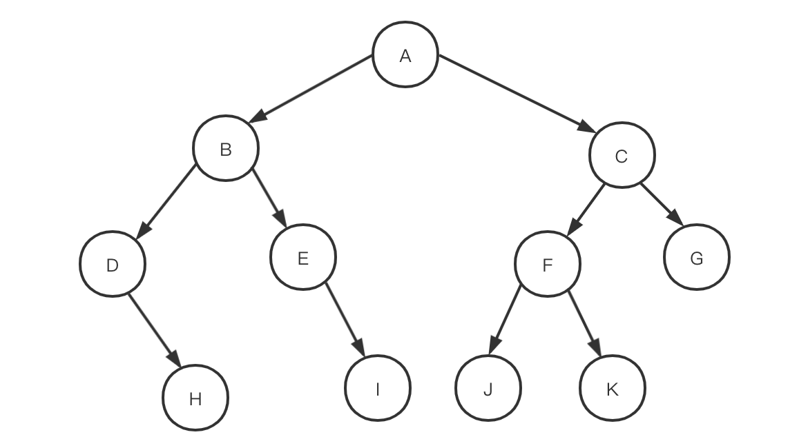

### 二叉树

#### 定义

每个节点最多只有两个分支的树结构, 子树分左右.

每层的节点数<=2^(i-1), 总共的节点数

假设**根节点的层数为1,** 则一颗**二叉树总共的节点数不超过2^k-1**(等比数列求和公式得来)

#### 特殊类型

##### 满二叉树

定义: 深度为k, 且总节点数为2^k-1的二叉树, 数的外形是严格三角形.

假设总结点数为n, 则树高为$log_2(n+1)$.

##### 完全二叉树

定义: 高度为h的二叉树,  其第0到(h-1)层的节点都满, 第h层节点不满, 且最后一层的节点都是从左往右排, 节点都在左边, 空位都在右边. Called 完全二叉树. 与满二叉数的节点一一对应.

性质: 

一棵完全二叉树的节点数目为 n, 假设根节点的序号为0,  则最后一个节点的序号为n-1. 

对于序号为i的节点, 其父节点序号为 **(i-1)/2** [向下取整 画图可知]. 左子节点为left = 2\*i+1(前提是left<=n-1), 右子节点序号为 right = 2\*i+2(前提是right<=n-1).

#### 存储结构

#### 遍历

按照系统化方式访问二叉树的每一个节点, 每棵二叉树都有唯一的根节点 root, 是基于树结构的处理入口.

> 深度优先遍历

##### 前(根)序遍历

先访问根节点, 再访问左节点和右节点

ABDHEICFJKG

##### 中(根)序遍历 

先访问左子树, 再访问根节点, 再访问右子树

DHBEIAJFKCG

##### 后(根)序遍历

先访问左右子树, 再访问根节点.

HDIEBJKFGCA

注意: 任意一棵树的任意一种遍历序列都无法唯一确定相应的二叉树.

> 广度优先遍历

##### 层序遍历

ABCDEFGHIJK

##### 遍历实现

主要使用递归法进行理解与实现.

深度优先一般使用递归方法/栈结构,  广度优先遍历使用队列.

中序(知道左右子树的位置)+前序/后序(知道根节点的位置) + 元素不重复 --> 复原二叉树结构

##### 复杂度分析

统计每个节点被访问的次数

#### 

### 二叉查找树(Binary Search Tree-BST)

每个节点都包含一个可比较的键以及相应的值, 且每个节点的值都>=左子树中任意节点的键, <右子树中任意节点的键.

**使用中序遍历可以得到一个有序数组**.

BST使用的每个节点含有2个链接.