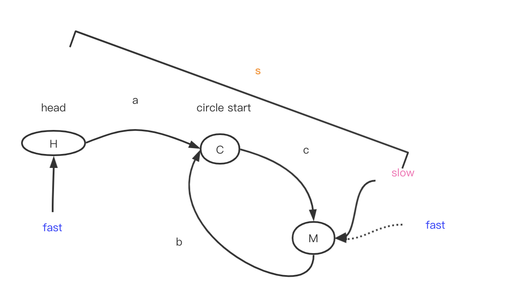
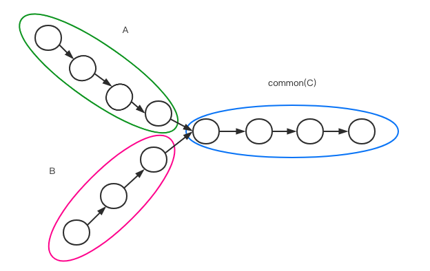

#### [2] Add Two Numbers

> You are given two **non-empty** linked lists representing two non-negative integers. The digits are stored in **reverse order** and each of their nodes contain a single digit. Add the two numbers and return it as a linked list.
>
> You may assume the two numbers do not contain any leading zero, except the number 0 itself.

复杂的数据结构是我的超级短板. 但是也算勉强看懂了js是如何表示链表的.

```javascript
/**
 * @param {ListNode} l1
 * @param {ListNode} l2
 * @return {ListNode}
 */
// 这个链表的存储结构是嵌套的, 即next指向的是嵌套的.
var addTwoNumbers = function (l1, l2) {
  // 定义存储想关节点的变量
  let result = new ListNode(null);
  let lastNode = result;
  let carry = 0; // 进位
  let val = 0; // 相加之后赋给当前位置的值
  // 当l1或者l2任何一方有值时, 都需要进行相加
  while (l1 || l2) {
    // 获取两个链表的初始值
    let x = l1 == null ? 0 : l1.val;
    let y = l2 == null ? 0 : l2.val;
    // 两者相加
    let num = x + y + carry;
    carry = Math.floor(num / 10); // 商
    val = num % 10; // 相加之后赋给当前位置的值
    // 新建节点添加到链表末尾
    lastNode.next = new ListNode(val);
    // 最后节点位置更新
    lastNode = lastNode.next;
    // 进行下一位置的加法
    if (l1 !== null) l1 = l1.next;
    if (l2 !== null) l2 = l2.next;
  }
  // 当两个加数位数都加完了
  // 但是仍然可能会有进位的可能
  if (carry != 0) {
    lastNode.next = new ListNode(carry);
  }
  return result.next;
};

/*
示例结果
====result.next
ListNode {
  val: 7,
  next: ListNode {
    val: 0,
    next: ListNode {
      val: 8,
      next: null
    }
  }
}
*/
```


#### [21] Merge Two Sorted Lists

> Merge two sorted linked lists and return it as a new **sorted** list. The new list should be made by splicing together the nodes of the first two lists.

解题的重点在于, 一直将l1和l2的链表头作比较, 不断将较小的node加入结果链表, 直至l1或者l2为空, 说明遍历结束. 把不为空的链表剩余的部分直接接入结果列表.

```javascript
var mergeTwoLists = function (l1, l2) {
  // 处理有链表为空的情况
  if (l1 == null) {
    return l2;
  }
  if (l2 == null) {
    return l1
  }
  let res = new ListNode(null);
  let curr = res;
  // 网上的做法好简洁
  while (l1 && l2) {
    if (l1.val > l2.val) {
      curr.next = l2;
      l2 = l2.next;
    } else {
      curr.next = l1;
      l1 = l1.next;
    }
    curr = curr.next;
  }
  curr.next = l1 == null ? l2 : l1;
  return res.next;
};
```


#### [24] Swap Nodes in Pairs

> Given a linked list, swap every two adjacent nodes and return its head.
>
> You may **not** modify the values in the list's nodes, only nodes itself may be changed.

在交换链表的时候, 第一次交换需要记住链表头.

确定 `curr` 之后, 只有 `curr.next!=null` 时才有交换的必要, 否则说明交换到头了, 返回 `head` 即可.

```javascript
/**
 * @param {ListNode} head
 * @return {ListNode}
 */
var swapPairs = function (head) {
  let curr = head;
  let left = new ListNode(null);
  let i = 0; // 第一次交换的时候 需要记住链表头 后面就不需要了
  // 只有当 curr.next 也有值的时候, 才交换
  // 否则就直接返回
  while (curr && curr.next) {
    let temp = curr.next.next;
    let nextNode = curr.next;
    nextNode.next = curr;
    left.next = nextNode;
    curr.next = temp;
    left = curr;
    curr = curr.next;
    if (i == 0)
      head = nextNode;
    i++;
  }
  return head;
};
```


#### [61] Rotate List

> Given a linked list, rotate the list to the right by *k* places, where *k* is non-negative.

```javascript
/**
 * @param {ListNode} head
 * @param {number} k
 * @return {ListNode}
 * 大体思路是: 
 * 先计算出链表的长度len, 再将k与len进行比较, 
 * k>len的话, 将k中len的整数倍减去之后, 就是最后需要移动的元素的个数
 */

var rotateRight = function (head, k) {
  if (head == null) {
    return null;
  }
  // 计算链表长度
  // 此时right指向最后一个元素
  let left = head, right = head, len = 1;
  while (right.next) {
    right = right.next;
    len++;
  }
  if (len == 1 || k == len) {
    return head;
  }
  // 取余之后是实际上需要移动的元素
  let num = k % len;
  // 由于在计算链表长度的时候, right已经指向链表尾部
  // 左右指针间隔k-1个元素
  // 所以左指针需要向右移动len-num-1个位置
  // 具体的边界条件可以在测试中验证是否正确
  for (let i = 0; i < len - num - 1; i++) {
    left = left.next;
  }
  right.next = head;
  head = left.next;
  left.next = null;
  return head;
};
```


#### [23] Merge k Sorted Lists

> You are given an array of `k` linked-lists `lists`, each linked-list is sorted in ascending order.
>
> *Merge all the linked-lists into one sorted linked-list and return it.*

**solution1** 的时间复杂度分析:

时间复杂度: 遍历链表+排序+遍历数组
	假设总node数为 $N$ , 则总时间复杂度为 $O(N)+O(NlogN)+O(N)=O(N)$
空间复杂度为: $O(N)$ , 主要是存储节点的数组的消耗

**solution2** 的时间复杂度分析:

设k=lists.length, $N$ 为所有节点数, 则复杂度为=归并次数*每一次归并的时间复杂度
每一次归并需要遍历所有的节点, 但是不需要排序, 仅仅是大小比较, $O(N)$
设一共归并的次数为x, 则有 $2^x = k$ , 则 $ x = \log_2 k$ (以2为底k的对数)
所以总共的时间复杂度是 $\sum_0^x * O(N)=O(N\log k)$

```javascript
// solution 1
// 把链表中的节点值都拿出来放在一个数组里
// 然后对数组进行排序
var mergeKLists1 = function (lists) {

  let len = lists.length;
  if (len == 0) {
    return null
  }
  let arr = [], l;
  for (let i = 0; i < len; i++) {
    l = lists[i];
    while (l) {
      arr.push(l.val);
      l = l.next;
    }
  }
  arr.sort((a, b) => a - b); // 正序排列
  let res = new ListNode(null);
  let curr = res;
  for (let i = 0; i < arr.length; i++) {
    curr.next = new ListNode(arr[i]);
    curr = curr.next;
  }
  return res.next;
};

// solution 2
// 分治算法 这是一开始就想到的方法 但是不会实现🤦‍♀️
// 两两链表合并排序, 再将结果再合并, 直至只有一个结果
// 数组长度为奇数, 最后一次合并时, 是第一个与最后一个元素合并, interval*2之后会<len, 继续进行最后一次合并
// 数组长度为奇数, 最后一次合并时, 是第一个与中间元素合并, interval*2之后会=len, 跳出循环
var mergeKLists = function (lists) {
  let len = lists.length;
  // 没有链表返回空链表
  if (len == 0) {
    return null;
  }
  let interval = 1;// 标志需要合并的两个链表之间的距离
  // 归并排序的代码更像模板
  // 只要两个元素之间的距离没有超过数组长度, 说明没有归并完毕
  while (interval < len) {
    for (let i = 0; i < len - interval; i = i + interval * 2) {
      // i的作用是, 找到所有需要合并的链表中的第一个
      // 不断地把相隔interval距离的两个链表合并
      lists[i] = mergeTwoLists(lists[i], lists[i + interval])
    }
    interval = interval * 2;
  }
  return lists[0];
}

// 合并两个链表
var mergeTwoLists = (l1, l2) => {
  if (!l1) return l2;
  if (!l2) return l1;
  let res = new ListNode(null);
  let curr = res;
  while (l1 && l2) {
    if (l1.val < l2.val) {
      curr.next = l1;
      l1 = l1.next;
    } else {
      curr.next = l2;
      l2 = l2.next;
    }
    curr = curr.next;
  }
  curr.next = l1 == null ? l2 : l1;
  return res.next;
}
```


#### [25] Reverse Nodes in k-Group

> Given a linked list, reverse the nodes of a linked list *k* at a time and return its modified list.
>
> *k* is a positive integer and is less than or equal to the length of the linked list. If the number of nodes is not a multiple of *k* then left-out nodes in the end should remain as it is.

时间复杂度分析:

$O(N)$ , $N$为链表总节点数, 翻转时需要遍历所有的节点. 一共会进行$\lfloor N/k \rfloor$ 次翻转, 每一次翻转需要$O(k)$的时间.

空间复杂度: 常量级别.

```javascript
// 大体思路是 每k个元素进行一次翻转
// 在翻转之前查看接下来的链表长度是否足够
// 足够则翻转 不够则停下并返回结果
// 翻转时注意连接前后链表的部分
var reverseKGroup = function (head, k) {
  // 在链表头节点前加一个节点
  // 后面翻转后的链表再与原来的链表连接要用到
  let hair = new ListNode(null, head);
  let pre = hair;
  // tail需要以pre为起点, 向后移动k个位置
  let tail = hair, right;
  while (tail) {
    // 将 tail 移动至需要翻转的链表部分的末尾
    for (let i = 0; i < k; i++) {
      tail = tail.next;
      // 如果 tail 在向后移动但是还没有到目标位置时
      // 出现 tail 为 null 的情况
      // 说明剩余的元素已经不够翻转的数量
      // 直接返回现有结果即可
      if (!tail) return hair.next;
    }
    // head-tail的链表部分需要翻转
    // 且翻转需要head和tail仍指向翻转后链表的头和尾
    // 保留tail的后面部分
    right = tail.next;
    [head, tail] = reverse(head, tail);
    // 进行与原链表的拼接
    pre.next = head;
    tail.next = right;
    // 改变pre head的位置
    pre = tail;
    head = right;
  }
  return hair.next;
};

// 翻转链表
// 这里不用再初始化res来存储翻转后的结果
// 因为tail.next是存在的
// 可以看做已有的res使用
// 使用常数级的内存空间
var reverse = (head, tail) => {
  let p = head;
  let remain = tail.next; // 表示剩余不用翻转的部分
  let nex;
  while (p !== tail) {
    nex = p.next;
    p.next = remain;
    remain = p;
    p = nex;
  }
  tail.next = remain;
  return [tail, head];
}
```


#### [83] Remove Duplicates from Sorted List

> Given a sorted linked list, delete all duplicates such that each element appear only *once*.

思路比较简单, 由于最坏情况是遍历链表的所有节点(当所有节点的值均不相同),  时间复杂度为 $O(N)$ .

```javascript
// 由于是排过序的链表
// 所以重复元素都会在一块
// 不断比较curr与curr.next的val是否相等
// 相等则跳过该重复元素,不等才改变curr的位置
// 直至curr遍历完链表的所有元素
var deleteDuplicates = function (head) {
  if (!head) return null;
  let curr = head;
  while (curr) {
    // 最后一个元素是不同元素 到达链表末尾
    if (!curr.next) return head;
    while (curr.val == curr.next.val) {
      curr.next = curr.next.next;
      // 最后一个元素是相同元素 到达链表末尾
      if (!curr.next) {
        return head;
      }
    }
    curr = curr.next;
  }
};
```


#### [82] Remove Duplicates from Sorted List II

> Given a sorted linked list, delete all nodes that have duplicate numbers, leaving only *distinct* numbers from the original list.
>
> Return the linked list sorted as well.

遍历链表的所有节点两次,  时间复杂度为 $2*O(N) = O(N)$ .

```javascript
// 遍历两次链表
// 第一次按照顺序将所有不同的元素组成链表, 并给有重复元素的节点增加dup属性
// 第二次将有dup属性的节点删除, 返回结果
var deleteDuplicates = function (head) {
  let curr = head;
  while (curr) {
    if (!curr.next) break;
    while (curr.val == curr.next.val) {
      curr.dup = true;
      curr.next = curr.next.next;
      if (!curr.next) break;
    }
    curr = curr.next;
  }
  if (!head) return null;

  let hair = new ListNode(null, head);
  let pre = hair, point = head;
  while (point) {
    while (point.dup) {
      point = point.next;
      if (!point) {
        pre.next = null;
        return hair.next;
      }
    }
    pre.next = point;
    pre = point;
    point = point.next;
  }
  return hair.next;
};
```


#### [142] Linked List Cycle II

> Given a linked list, return the node where the cycle begins. If there is no cycle, return `null`.
>
> There is a cycle in a linked list if there is some node in the list that can be reached again by continuously following the `next` pointer. Internally, `pos` is used to denote the index of the node that tail's `next` pointer is connected to. **Note that `pos` is not passed as a parameter**.
>
> **Notice** that you **should not modify** the linked list.

这里需要证明下有环情况下, 为什么快慢指针第一次相遇之后, 快指针到链表头, 再和慢指针一起以每次一步的速度前进, 当二者相等时, 即是环的起点.

**证明**:



我们最终需要证明a=b. 假设链表总长度为L, 环的长度为R, 快慢指针第一次相遇的节点为M, 环的开始节点为C, 其中各个点之间的距离分别为 H->C=a, C->M=c, M->C=b, H->M=s. 第一次相遇时, 假设fast已经围绕着环走了n圈, 则有:

由于快慢指针的速度差两倍, 所以相同时间内, 快指针走过的距离是慢指针的两倍.

$2s = s + nR \\-> s = nR \tag{1}$

已知慢指针走的长度为(套用$(1)$):

$a+c = s \\-> a+c=nR \\-> a + c = (n-1)R + R \\-> a = (n-1)R + (R - c) \\->  a = (n-1)R +b$

则得出结论 $a=b$, (这个还要再想下).

所以fast移动到head, slow位置不变, 两个同时开始走, 每次走一步, 当走了a步时,两者相遇的点即为环的起点.


**时间复杂度**:

可知快慢指针走的步数是一样的, 只是一个快一个慢, 慢指针最后遍历了整个链表, 走了N步, 则快指针也走了N步, 则时间复杂度为: $2*O(N)= O(N)$.

```javascript
// 使用快慢指针
var detectCycle = function (head) {
  if (!head || !head.next) return null;
  // 快慢指针的起始点应该一样
  let fast = head;
  let slow = head;
  while (slow) {
    // 快指针的速度是慢指针的2倍
    slow = slow.next;
    // 在没有环的情况下
    // fast指针会最先到达链表尾部, 直接返回null;
    // fast指针最后的位置,要不倒数第一,要不倒数第二
    // 与链表长度的奇偶数以及每次走的步数有关
    // 这里fast指针是每次走两步
    if (!fast.next) return null
    fast = fast.next.next;
    if (!fast) return null
    // 说明有环 两指针第一次相遇
    if (fast == slow) {
      // 快指针移动至链表头
      // 慢指针停在原地
      fast = head;
      // 二者均以每次一步的速度继续向前走, 直至再次相遇
      // 这里方法需要证明
      while (fast != slow) {
        fast = fast.next;
        slow = slow.next;
      }
      // 返回的是环的起始节点的指针
      return fast;
    }
  }
};
```


#### [138] Copy List with Random Pointer

> A linked list is given such that each node contains an additional random pointer which could point to any node in the list or null.
>
> Return a [**deep copy**](https://en.wikipedia.org/wiki/Object_copying#Deep_copy) of the list.
>
> The Linked List is represented in the input/output as a list of `n` nodes. Each node is represented as a pair of `[val, random_index]` where:
>
> - `val`: an integer representing `Node.val`
> - `random_index`: the index of the node (range from `0` to `n-1`) where random pointer points to, or `null` if it does not point to any node.

**时间复杂度:** 遍历两遍数组 $O(N)$.

**经验/收获**: 

1. 一开始我的问题在于试错, 都没有搞清楚`random_index`属性是否在题目给的链表结构中存在, 我还以为有`random_index`这个属性呢, 实际上没有.  `random`数据类型仍然是指针而非number.
2. 搞清楚题目是深拷贝, 不能改变原有链表结构. **需要重新生成新链表**.
3. 收获在于知道如何使用hashMap存储链表间的 links.

```javascript
// 题目要求是深拷贝
// 就是不改变原有的链表
// 第一遍是copy all nodes, 使用map存储
// 第二遍是copy links
var copyRandomList = function (head) {
  if (!head) return null;
  // copy nodes
  let curr = head;
  let map = new Map(); // map的key可以是任何对象, 不限于字符串
  while (curr) {
    map.set(curr, new Node(curr.val));
    curr = curr.next;
  }
  // copy links
  curr = head;
  let node = map.get(curr);
  while (curr) {
    node.next = curr.next ? map.get(curr.next) : null;
    node.random = curr.random ? map.get(curr.random) : null;
    curr = curr.next;
    node = node.next;
  }
  return map.get(head);
};
```


#### [92] Reverse Linked List II

> Reverse a linked list from position *m* to *n*. Do it in one-pass.
>
> **Note:** 1 ≤ *m* ≤ *n* ≤ length of list.

**时间复杂度分析**:

假设链表总长度为$N$, 在定位m/n节点的过程中, 一共遍历链表一次, 每次遍历至第n个节点, 最差情况遍历到链表末尾.

翻转时一共需要翻转 $n-m+1$ 个节点, 需要的时间是 $ O(n-m+1)$ .

所以时间复杂度为 $O(N)$ 

**注意**:

初始化一个节点时, hair不是空, hair.val是空. 刚开始判断pre==null就写错了, 应该是pre.val是否null.

```javascript
var reverseBetween = function (head, m, n) {
  // 特殊情况
  if (!head) return null
  if (!head.next) return head;
  // 当链表长度足够翻转时, 在head前添加hair节点
  // 为了使用pre节点, pre是pm的前一个节点
  let hair = new ListNode(null, head);
  let pre = hair, curr = head;
  // 定义变量 注意需要tail指针
  let pm, pn, tail;

  // 定位m节点
  if (m == 1) {
    pm = head; // pm直接是头节点
  } else {
    // m-1次循环到达pm节点
    for (let i = 0; i < m - 1; i++) {
      // pre节点也需要同时向后移动
      // 保证在pm前一位
      curr = curr.next;
      pre = pre.next;
    }
    pm = curr;
  }
  // 定位n节点
  for (let i = 0; i < n - m; i++) {
    curr = curr.next;
  }
  pn = curr;
  // 翻转前保留尾部数据
  tail = curr.next;
  // 翻转
  while (pm != pn) {
    let temp = pm.next;
    pm.next = tail;
    tail = pm;
    pm = temp;
    pre.next = tail;
  }
  // pm==pn时还需要连接下tail
  pm.next = tail;
  // 连接
  pre.next = pm;
  // 这里返回hair.next即可
  // 不用分析pre是否为空
  return hair.next;
};
```


#### [147] Insertion Sort List

> Sort a linked list using insertion sort.

时间复杂度分析:

遍历链表一次, $O(N)$

每到链表的一个节点, 就会扫描排好序的链表部分, 时间为 $O(1)+O(2)+O(3)+...+O(N-1)$

则时间复杂度为: $O(1)+O(2)+...+O(N)=O((N^2+N)/2)=O(N^2)$

```javascript
// 使用插入排序对链表进行排序
// 插入排序是: 不断将没有排序的元素加入已经排好序的部分
// 单向链表只能从前往后遍历
// 这里顺便学习了单向链表
var insertionSortList = function (head) {
  if (!head) return null;
  if (!head.next) return head;
  // 第一个元素默认已经排好序
  // curr 从下一位开始
  let curr = head.next;
  // 初始化
  // 排好序的部分此时只有head一个元素
  // 末尾指向null
  // 与需要排序的部分分开
  head.next = null;
  let cn, hn;
  while (curr) {
    // 保留curr的后一部分
    cn = curr.next;
    // curr比有序的第一个元素小
    // 则直接置于有序部分的头部
    if (curr.val <= head.val) {
      curr.next = head;
      head = curr;
    } else {
      // curr 比第一个有序元素大
      // 则需要遍历后面的有序元素
      // 直到找到有序排列中比curr大的元素x
      // 则curr插入到 x的前面
      // 为了保留 x 的前一个节点
      // 将curr.val与h.next.val进行比较, 而不是h.val
      let h = head;
      while (h.next && curr.val > h.next.val) {
        h = h.next;
      }
      // 将curr插入至 h 与 x 节点之间
      hn = h.next;
      h.next = curr;
      curr.next = hn;
    }
    // curr向后移动一位
    curr = cn;
  }
  return head;
};
```


#### [203] Remove Linked List Elements

> Remove all elements from a linked list of integers that have value ***val\***.

时间复杂度: 遍历链表 $O(N)$

```javascript
var removeElements = function (head, val) {
  if (!head) return null;
  let hair = new ListNode(null, head);
  let pre = hair, curr = head;
  // pre的移动也是在head表示的这条链表上
  // pre改变的是head本身
  while (curr) {
    if (curr.val == val) {
      pre.next = curr.next;
    } else {
      pre = curr;
    }
    curr = curr.next;
  }
  // 有个特殊情况需要注意
  // 比如 [1] 1
  // 此时pre还没后移到head链表上
  // 所以pre指向null没有改变head链表
  // head仍然是 [1]
  return hair.next;
};
```


#### [206] Reverse Linked List

> Reverse a singly linked list.
>
> **Follow up:**
>
> A linked list can be reversed either iteratively or recursively. Could you implement both?

**递归过程**需要详细的过程分析图(**TO DO**).

两种时间复杂度均为 $O(N)$. 

递归方法的时间复杂度分析: 遍历整个链表, 递归调用N次.

```javascript
// 迭代翻转
// 空间复杂度 O(1)
var reverseList1 = function (head) {
  let rever = new ListNode(null);
  let temp;
  while (head) {
    temp = head.next;
    head.next = rever.next;
    rever.next = head;
    head = temp;
  }
  return rever.next;
};

// 递归翻转
// 需要注意的是, p是指向head的一个指针
// 并不是另外的链表
// 但是由于每一次都会生成p指针重新指向目前已经倒好序的链表
// 所以递归过程中的空间复杂度为O(1)+O(2)+...+O(N)=O(N)
var reverseList = function (head) {
  if (!head || !head.next) return head;
  let p = reverseList(head.next);
  head.next.next = head;
  head.next = null;
  return p;
};
```


#### [237] Delete Node in a Linked List

> Write a function to **delete a node** in a singly-linked list. You will **not** be given access to the `head` of the list, instead you will be given access to **the node to be deleted** directly.
>
> It is **guaranteed** that the node to be deleted is **not a tail node** in the list.

注意看题目条件, 时间/空间复杂度均为 $O(N)$.

```javascript
// 一时没有想起来用什么解法
// 因为之前删除节点都是不能改变节点自身的值
// 现在这个能改变了 害
// 这个方法令我哭笑不得, 也提醒自己注意看题目条件
var deleteNode = function(node) {
    node.val = node.next.val;
    node.next = node.next.next;
};
```


#### [234] Palindrome Linked List

> Given a singly linked list, determine if it is a palindrome.
>
> **Follow up:**
> Could you do it in O(n) time and O(1) space?

时间复杂度: 

遍历链表一次, $O(N)$, 后半部分翻转链表的时候, 时间为$O(N/2)$.

所以时间复杂度为: $O(N)+O(N/2)=O(N)$.

方法:

判断回文链表,要求只能遍历一次链表.

将链表**后半段翻转** 再将前后部分分别比较.

然后还有需要注意的是: **快慢指针法寻找链表中心点**

```javascript
var isPalindrome = function (head) {
  if (!head || !head.next) return true;
  let fast = head, slow = head;
  while (fast.next && fast.next.next) {
    fast = fast.next.next;
    slow = slow.next;
  }
  // 不管链表长度是奇数还是偶数 需要进行的操作都是一样的
  // slow 为后半部分链表的起点
  slow.next = reverse(slow.next);
  slow = slow.next;
  // 将前后两部分链表逐个节点对值进行比较
  // 如果有值不等 说明不是回文
  // 前半部分的长度是>=后半部分的
  // 所以当slow=null时, head=null或者head是最后一个节点
  // 由于回文的两种形式, 此时就可以结束比较了
  while (slow) {
    if (head.val != slow.val) {
      return false;
    }
    head = head.next;
    slow = slow.next;
  }
  return true;
};

// 翻转链表
var reverse = (head) => {
  let res = new ListNode(null);
  let curr = head, cn, rn;
  while (curr) {
    cn = curr.next;
    rn = res.next;
    res.next = curr;
    curr.next = rn;
    curr = cn;
  }
  return res.next;
}
```


#### [160] Intersection of Two Linked Lists

> Write a program to find the node at which the intersection of two singly linked lists begins.
>
> **Notes:**
>
> - If the two linked lists have no intersection at all, return `null`.
> - The linked lists must retain their original structure after the function returns.
> - You may assume there are no cycles anywhere in the entire linked structure.
> - Each value on each linked list is in the range `[1, 10^9]`.
> - Your code should preferably run in O(n) time and use only O(1) memory.



由图可知:

$headA = A + C$

$headB = B + C$

所以:

$newA = headA + headB = A + C + B + C$

$newB = headB + headA = B + C + A + C$

已知:

$A + C + B = B + C + A$

所以 `newA`与`newB`同时出发, 每次都走一步. 

`newA`走完`headA`再走完`B`,  `newB`走完`headB`再走完`A`, 如果两者有交点, 则此时会相等且不为`null`;

如果不相交, 则走到最后两者也相等, 但是为`null`.

时间复杂度:

假设`headA`和`headB`总共的长度为`N`, 则一共遍历了两次, 时间为$2*O(N)$, 时间复杂度为$O(N)$.

```javascript
// 思路很巧妙 需要分析下 最后两个节点一定会相等
// 只是是地址还是null的问题
// 最差情况是不相交
// 每个链表均遍历了两遍
// 但是额外空间只使用了两个指针变量,为常数级
var getIntersectionNode = function (headA, headB) {
  let currA = headA, currB = headB;
  while (currA != currB) {
    currA = !currA ? headB : currA.next;
    currB = !currB ? headA : currB.next;
  }
  // 不相交最后也会相等的 均是null
  // 即： 相交或者是不相交， 二者均会相等
  // 相等的话，返回的是及交点地址
  // 不相等的话，返回的是null
  return currA;
};
```


#### [328] Odd Even Linked List

> Given a singly linked list, group all odd nodes together followed by the even nodes. Please note here we are talking about the node number and not the value in the nodes.
>
> You should try to do it in place. The program should run in O(1) space complexity and O(nodes) time complexity.

时间复杂度: 两个指针同时遍历, 一共遍历一遍链表. $O(N)$

空间复杂度: 只是新建了两个指针, 改动原有链表, 没有重新生成head的copy版本. $O(1)$

```javascript
// 完全自己想的法子 太棒了
// 大体思路就是,用两个指针, 一个指向奇数节点, 一个指向偶数节点
// 遍历完head之后, 再将两个链表进行拼接
var oddEvenList = function (head) {
  if (!head || !head.next || !head.next.next) return head;
  let oddList = new ListNode(null);
  let evenList = new ListNode(null);
  let odd = oddList, even = evenList;
  // 初始化第一个奇数节点
  odd.next = head;
  odd = odd.next;
  // 初始化第一个偶数节点
  even.next = head.next;
  even = even.next;
  while (even && even.next) {
    odd.next = odd.next.next;
    odd = odd.next;
    even.next = even.next.next;
    even = even.next;
    // 链表长度为奇数 此时 even==null
    // 链表长度为偶数 此时 even.next==null
    // 两种情况的任何一种情况都应该退出循环
  }
  // 对奇数链与偶数链进行拼接
  odd.next = evenList.next;
  return oddList.next;
};
```


#### [725] Split Linked List in Parts

> Given a (singly) linked list with head node `root`, write a function to split the linked list into `k` consecutive linked list "parts".
>
> The length of each part should be as equal as possible: no two parts should have a size differing by more than 1. This may lead to some parts being null.
>
> The parts should be in order of occurrence in the input list, and parts occurring earlier should always have a size greater than or equal parts occurring later.
>
> Return a List of ListNode's representing the linked list parts that are formed.
>
> Examples 1->2->3->4, k = 5 // 5 equal parts [ [1], [2], [3], [4], null ]

理解题意 一共分为 k 部分 而不是长度是 k !!

*时间复杂度**:

在计算链表长度时, 遍历了一次. 后面将链表片段加入时, 又遍历了一遍.

所以时间复杂度为 $O(N+k)$, 在`k>len`时, 需要继续向结果中加入片段.

**空间复杂度**:

生成`answer`时res数组中包含的节点个数, `k>len`, k个链表节点, 反之, len个链表节点. 所以空间复杂度为$O(max(N, k))$.

```javascript
var splitListToParts = function (root, k) {
  // 先计算root的长度
  let curr = root, len = 0;
  while (curr) {
    len++;
    curr = curr.next;
  }
  curr = root;
  // 计算宽度
  let width = Math.floor(len / k);
  let extra = len % k; // 需要长度被加一的组数
  let res = []; // 初始化长度为k的结果数组
  for (let i = 0; i < k; i++) {
    // 当k<=len的时候,curr指向null时, for循环也就结束了
    // 因为组数已经达到了k组
    // 出现curr为null的情况时, 并且走到了这里
    // 说明k>len
    // 此时只需要将null不断加入数组直至数组长度达到k
    if (!curr) {
      res.push(null);
      continue;
    }
    // 多余没有入组的元素需要加入前面的每一个组
    // 因此前extra组, 每组的元素长度需要+1
    let l = i < extra ? width + 1 : width;
    // l-1是为了控制curr指向part的最后一个元素而不是下一个
    // 便于将该链表片段加入res
    for (let j = 0; j < l - 1; j++) {
      curr = curr.next;
    }
    // curr 到达part的最后一个元素      
    let cn = curr.next;
    curr.next = null;
    res.push(root);
    curr = root = cn;
  }
  return res;
};
```


#### [445] Add Two Numbers II

> You are given two **non-empty** linked lists representing two non-negative integers. The most significant digit comes first and each of their nodes contain a single digit. Add the two numbers and return it as a linked list.
>
> You may assume the two numbers do not contain any leading zero, except the number 0 itself.
>
> **Follow up:**
> What if you cannot modify the input lists? In other words, reversing the lists is not allowed.

题目要求不能翻转链表, 于是遍历链表, 将链表中的数都存进栈中. 再通过将栈弹出, 进行相加操作.

**时间复杂度**:

遍历两个链表, O(N). 两个栈均弹出进行相加操作, O(N). 因此时间为 $2O(N)=O(N)$

**空间复杂度**:

使用两个栈存储数字, O(N), 相加之后得到新的结果列表的长度 O(max(m, n)) ps.是两个链表中较长的那一个Lmax, 结果链表长度可能由于进位问题会是Lmax+1, 因此空间复杂度为 $O(N)+O(max(m, n))$.

```javascript
// 不能够翻转链表
// 使用两个栈存储数字
var addTwoNumbers = function (l1, l2) {
  // 将两个链表中的值分别存进两个栈中
  let stack1 = [], stack2 = [];
  while (l1) {
    stack1.push(l1.val);
    l1 = l1.next;
  }
  while (l2) {
    stack2.push(l2.val);
    l2 = l2.next;
  }
  // 初始化变量
  let sum = 0, carry = 0, num = 0;
  let res = new ListNode(null), rn;
  let add1, add2;
  // 当两个栈有至少一个不为空时, 都进行相加操作
  // 为空的那个栈的加数为 0
  while (stack1.length != 0 || stack2.length != 0) {
    add1 = stack1.length == 0 ? 0 : stack1.pop();
    add2 = stack2.length == 0 ? 0 : stack2.pop();
    sum = add1 + add2 + carry;
    // 商是进位 大于10为1,小于10为0
    carry = Math.floor(sum / 10);
    // 余数是相加之后结果中的数字
    num = sum % 10;
    // 将结果添加进结果列表中
    rn = res.next;
    res.next = new ListNode(num);
    res.next.next = rn;
  }
  // 当两个链表均为空时, 看是否还有进位
  // 有进位则添加进结果列表中
  if (carry != 0) {
    rn = res.next;
    res.next = new ListNode(carry);
    res.next.next = rn;
  }
  return res.next;
};
```


