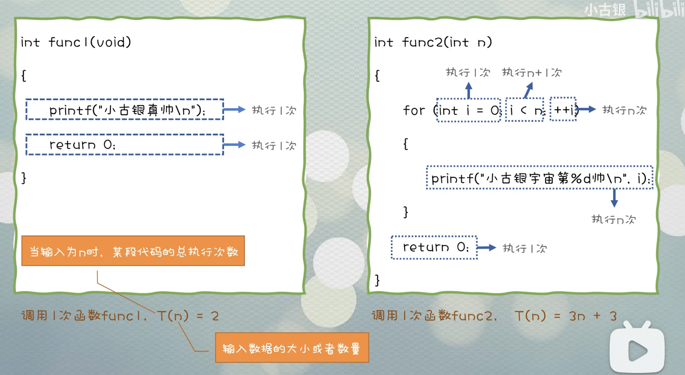

# 数据结构与算法

数据结构是工具, 算法是通过合适的工具解决特定问题的方法.

## 数据结构的存储方式

数据结构的存储方式只有两种: 数组(顺序存储)与链表(链式存储)

| 数据结构 | 定义                                                       | 数组                          | 链表                                                         |
| -------- | ---------------------------------------------------------- | ----------------------------- | ------------------------------------------------------------ |
| 队列/栈  |                                                            | 需要扩容                      | 更多空间存储指针                                             |
| 图       | 多对多                                                     | 邻接矩阵                      | 邻接表                                                       |
| 散列表   | 通过散列函数将键映射到一个大数组里  <br />需要解决散列冲突 | 线性探查法                    | 拉链法                                                       |
| 树       | 一对多                                                     | 堆, 完全二叉树,不需要节点指针 | 不一定是完全二叉树, 衍生出各种巧妙的设计<br /> eg. 二叉搜索树/AVL树/红黑树/区间树/B树等, 应对不同的问题. |


## 数据结构的基本操作

遍历(找) + 访问(改) (具体点: 增删改查)

两种形式: 线性(for/while循环) & 非线性(递归)

<!--more-->

# 时间复杂度的计算




#### 二叉搜索树操作

二叉树算法设计: 明确一个节点要做的事, 剩下的交给框架.

判断 BST 的合法性/增/删/查

##### 判断BST合法性

##### 在BST中查找一个数是否存在

##### 在BST中插入一个数

##### 在BST中删除一个数 


# 计算机网络


## 计算机如何上网

网卡由MAC地址唯一标识, 传递信件时需要知道对方的MAC地址, 工作在数据链路层.

为了连接互联网, 计算机 C 首先插入一根网线, 网线与网卡相连. 

### 计算机获取IP地址

获取IP地址需要使用DHCP(动态主机配置协议), 需要寻找 DHCP 服务器, 进行动态分配地址

插入的网线对应的网络中有 DHCP 服务器, 需要与其联系

首先, 计算机的CPU传递如下内容给网卡.

```
收件人: 255.255.255.255:67
发件人: 0.0.0.0:68
内容: 谁有IP地址
```

由于网卡不知道对方的MAC地址, 只能对外广播, 即所有电脑都会收到该消息

网卡对报文进行一层封装之后, 通过网线发送如下内容给交换机:

```js
/* 请求 IP 地址的包 */

// 下面两行为网卡封装
目的地: FF:FF:FF:FF:FF:FF // 广播到同一子网内的所有电脑
发件人: 11:27:F5:8A:79:54 // 该网卡的MAC地址

收件人: 255.255.255.255:67
发件人: 0.0.0.0:68
内容: 谁有IP地址
```

交换机在看到目的地是 FF:FF:FF:FF:FF:FF 之后, 就立刻转发给了所有连接该交换机的设备, 当然该局域网中所有的 DHCP 服务器都能收到.

由于局域网中不止一个 DHCP 服务器, 所以计算机可能会收到很多条有IP地址的消息, 但是由于计算机只需要一个IP, 所以针对某一条消息进行了确认回复, 网卡再次进行广播, 对应的 DHCP 服务器发来确认信息.

```javascript
/* 选择 IP 地址的回复包(广播) */
目的地: FF:FF:FF:FF:FF:FF
发件人: 11:27:F5:8A:79:54
内容: 服务器 192.168.1.1, 确认需要你提供的 IP: 192.168.1.2

/* DHCP 服务器的回复*/

分配的IP: 192.168.1.2
网关路由器: 192.168.1.1
DNS服务器: 202.102.224.69
```

计算机收到这些信息之后, 就会将这些信息存进内存中, 但是计算机重启之后, 需要将上述过程重复一遍, 来获取IP地址. 除非手动配置IP地址/网关/DNS, 但是容易出错, 一般都是开机自动获取IP地址.

现在的网络结构

```javascript
当前计算机
IP: 192.168.1.2
MAC: 11:27:F5:8A:79:54
|
交换机
|
DHCP 服务器/网关路由器
192.168.1.1
|
'其他局域网'
|
DNS 服务器
202.102.224.69
```

有了IP地址之后, 就可以上网了, 现在在浏览器输入一个域名www.baidu.com. 首先, 计算机需要查找这个域名对应的 IP 地址, 则需要准备DNS查询, 与DNS服务器通信.

```javascript
/* 查询域名对应IP的包 */

发件人: 192.168.1.2 // 本机 IP
收件人: 202.102.224.69 // DNS 服务器
内容: 帮忙查询 www.baidu.com 的域名
```

但是上述报文到了数据链路层, 网卡需要将这个信息先发送给网关路由器, 则需要先知道它的MAC地址.

于是网卡又进行一次广播, 寻找网关路由器的MAC地址. 这里采用的方法是 **ARP** (地址解析协议), 网卡通过广播下述内容, 网关路由器收到后, 就会创建一个ARP应答, 回复自己的 MAC 地址.

```javascript
/* 查询网关服务器MAC地址的包*/

收件人: FF:FF:FF:FF:FF:FF
发件人: 11:27:F5:8A:79:54
内容: 寻找网关路由器(192.168.1.1)的MAC地址

// ARP 应答
网关路由器MAC地址: 88-25-93-79-E0-C8
```

知道网关路由器的MAC地址后, 就可以将DNS查询的包在数据链路层通过网卡发送给网关路由器, 路由器抽取DNS查询的数据报, 看到收件人是非此局域网的 DNS 服务器, 则可以转发出去, DNS 服务器最后会收到并且进行回复, 最终得到百度域名的IP地址: 180.101.49.12.

接着浏览器开始与180.101.49.12这台服务器建立TCP连接, 通过TCP发送 HTTP GET 请求, 获得百度网页, 然后展示在浏览器中.

无线网卡通过USB与电脑连接, 不需要网线, 同样能够 DHCP/ARP/DNS, 然后上网.


总结:

网卡广播, 谁有IP? get IP.

网卡广播, 网关你的MAC地址说一下? get 网关MAC地址.

网卡发送DNS查询给网关服务器, 网关转给DNS服务器. get 域名对应IP.


### 路由器

功能: 建立路由表, 做路由选择, 转发IP数据包.

网关路由器

负责局域网内机器IP的分发, 同时, 具有外网IP地址(假设是 61.52.247.112), 局域网内的机器想要上外网必须经过网关路由器.

网关路由器收到局域网内机器(假设是 192.168.1.2)的报文并向外网(查看IP数据报层的目标IP得知)发送之前, 会进行如下操作:

- TCP报文中的源端口换成自己新创建的端口
- IP 数据报层的IP源地址换成自己在外网中的地址
- 以太网帧的MAC源地址也换成自己的MAC地址(有没有记录局域网机器的MAC地址?)

全部替换完成后, 再向外网发送. 

这种替换源地址与源端口的操作称之为**网络地址转换(NAT)**, 同时, 在网关路由器内部会建立一个映射表, 记录自己替换的信息, 叫做**NAT转换表**.

| NAT转换表          |                  |
| ------------------ | ---------------- |
| WAN端              | LAN端            |
| 61.52.247.112:2001 | 192.168.1.2:3345 |
| ......             | ......           |

在收到外网的回复后, 查看 IP 层的信息, 发现目标地址是61.52.247.112, 目标端口是2001, 则查询NAT转换表之后, 知道该报文需要转发给局域网内的机器192.168.1.2的3345端口, 于是再次修改报文中的目标地址与目标端口, 将修改后的数据报发送给局域网机器.

UPnP


# 计算机语言

## 编译型语言 解释型语言

**编译**: 源代码(高级语言写的代码)转换成目标代码(汇编或者机器(`CPU`)能够理解的代码)

**解释**: 解析源代码, 并直接执行, 没有编译的过程. 或者说, 把源代码转换成中间表示(软件`CPU`的指令), 然后执行.

其实编译和解释就是编译的程度, 现在的编译其实就是直接转换成二进制代码, 解释其实就是转换成中间状态.

很多动态语言不仅有解释器, 还有自己的虚拟机, called **高级语言虚拟机**, 有一套自己的指令集, 相当于一个软件`CPU`. 

为了在软件`CPU`上执行代码, 需要将源代码转换成软件`CPU`的指令, 其实类似于典型的编译过程. 但是 `Ruby` 并没有暴露出像`javac`这样的编译接口供程序员使用, 由语法树到指令的编译过程是内部操作的对外不暴露. `Ruby` 软指令最后也不会转换成物理`CPU`的机器指令.


## 面向对象

数据结构的某些数据是私有的, 不能被它的使用者看见, 必须通过固定的访问方式才能访问, 不能随意就访问到了.

➡️ 需要将数据与操作结合起来形成 Object, 属性数据不能直接访问, 只能通过Object的函数来访问.

➡️ 但是很多 Object 的方法都是重复的, 于是这些重复的方法代码都被放进了一个 Class 中

➡️ 此时如何使用Class中的方法呢? 通过Class创建新对象, 从此时新对象可以使用Class中的方法, 创建对象方式是 new Class, 使用 new 关键字.

➡️ 这样会产生很多的对象, 则对象的方法使用时, 需要区分是哪一个对象, 于是需要在使用方法时, 将需要进行操作的对象作为隐藏参数传入.

➡️ 继承: 很多Class有重复功能, 将重复的代码放进父类中, 子类可以直接使用. 

➡️ 多态: 对于同一个接口, 使用不同的实例而执行不同的操作.

```javascript
class Animal {
  constructor(name) {
    this.name = name;
  }
  speak () { console.log(`${this.name} make a noise`); }
}

class Dog1 extends Animal {
  constructor(name, sex) {
    // 调用超类构造函数并传入name参数
    // 必须先super 然后才能使用this
    super(name);
    this.sex = sex;
  }
  speak () { console.log(`${this.name} is ${this.sex} and barks`); }
}

let d = new Dog1('cookie', 'girl');
d.speak(); // cookie is girl and barks
// 这里执行的是 Dog1 的 speak 方法而不是 Animal的 speak 方法.
// 体现多态特征
```

继承破坏了封装性, 父类的很多细节对子类都可见. 

优先使用组合而不是继承 <<Head First 设计模式>>

面向接口编程而不是实现编程. <<设计模式: 可复用面向对象软件的基础>>

编程的关键是要抽象, 系统需求抽象成高层概念, 在概念层次进行编程.