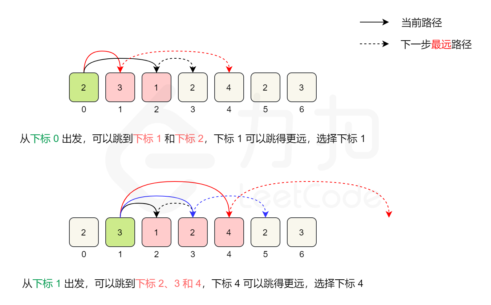
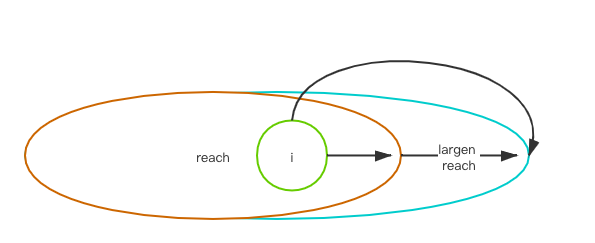

#### [45] Jump Game II

>  Given an array of non-negative integers, you are initially positioned at the first index of the array.
>
>  Each element in the array represents your maximum jump length at that position.
>
>  Your goal is to reach the last index in the minimum number of jumps.


贪心算法, 局部解得到最优解.

解题思路: 每次查找当前位置能够到达的位置中, 能跳到最远位置的位置A, 下次就跳到位置A, 然后再从位置A能到达的位置中, 再找能跳到最远位置的位置, 如此循环.

但是官方解答虽然简洁, 但是我不是看的很明白, 还是暂时先贴自己的直白解法吧.



```javascript
// 对于当前index, 每次在能跳到的范围内
// 跳到能跳到更远地方的index
var jump = function (nums) {
  let len = nums.length;
  if (len == 1)
    return 0;
  if (nums[0] >= len - 1)
    return 1

  let step = 0;
  let nextPosMap = { 'index': 0, 'maxIndex': 0 + nums[0] };

  for (let i = 0; i < len;) {
    let indexLimit = i + nums[i];
    // 在寻找下一步跳的位置时, 步数加一
    step++;
    for (let j = i + 1; j <= indexLimit && j < len; j++) {
      if (j + nums[j] > nextPosMap.maxIndex) {
        nextPosMap.index = j;
        nextPosMap.maxIndex = j + nums[j];
      }
    }
    // index != i, 说明能跳到更远距离的index更新了, 这时才需要将当前节点 i 移到index
    // 其实肯定更新, 题目已经说了能跳到最后
    // 移动才算跳了一步
    // 同时能跳到的最远位置不要超过数组边界
    // 超过数组边界则表示步数已经能计算出来了 return
    if (nextPosMap.maxIndex < len - 1) {
      i = nextPosMap.index;
    } else {
      // 当最大位置能到达最后时, 返回step+1
      // 把跳到最后位置的一步也加上
      return step + 1;
    }
  }
};
```


#### [55] Jump Game

> Given an array of non-negative integers, you are initially positioned at the first index of the array.
>
> Each element in the array represents your maximum jump length at that position.
>
> Determine if you are able to reach the last index.


一开始尝试使用递归做法, 计算所有的可能性, 但是想也不是最好的解法, 最后很可能超时, 果不其然超时.

于是就去看网上解法, 这里的考点是**贪心算法**.

> 贪心算法（又称贪婪算法）是指，在对[问题求解](https://baike.baidu.com/item/问题求解/6693186)时，总是做出在当前看来是最好的选择。也就是说，不从整体最优上加以考虑，算法得到的是在某种意义上的局部最优解


该题的大概思路是:

数组的第一个元素的值为 reach, 从数组的第一个元素开始, 每次计算在reach范围内的元素们所能到达的最远距离, 是否超过reach, 如果超过了, 就更新reach值为较大值. 直至reach的值超过lastIndex 返回 true.



```javascript
/**
 * @param {number[]} nums
 * @return {boolean}
 */
// 递归超时 使用贪心算法求解
// 局部能够到达的最大范围, 也是全局能够到达的最大范围
var canJump = function (nums) {
  let reach = nums[0];
  // 需要注意的点是,这里reach的值不一定就>1, 所以i不一定就从1开始
  // 还是从0开始能够包含所有情况, 这么写因为有个特例 [0]
  // 同时注意限制 i 的范围, i 是指 reach 能够到达的位置范围, 不能超过 reach
  for (let i = 0; i < nums.length && i <= reach; i++) {
    if (nums[i] + i > reach) {
      reach = nums[i] + i;
      // console.log(reach);
    }
    // 当能到达的范围超过数组的最后 index 时, 返回 true
    if (reach >= nums.length - 1)
      return true
  }
  // 能到达的元素位置都尝试了, 但是没有一个位置可以到达最后一个元素
  return false
};
```


